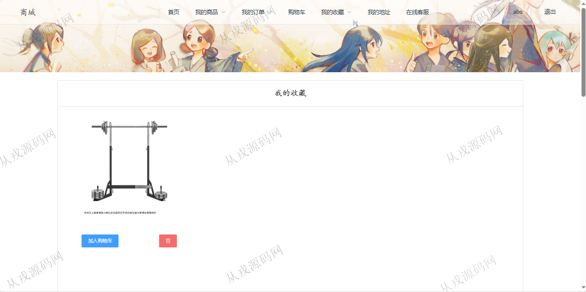
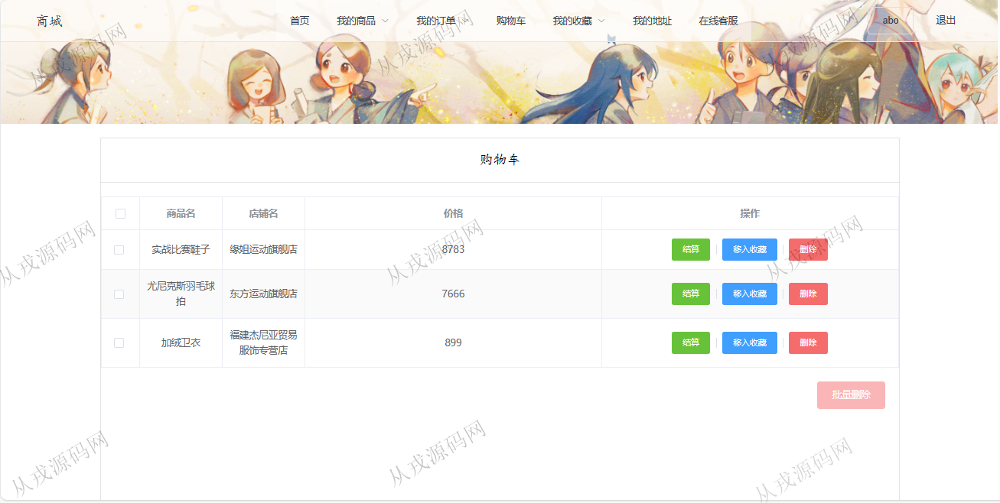
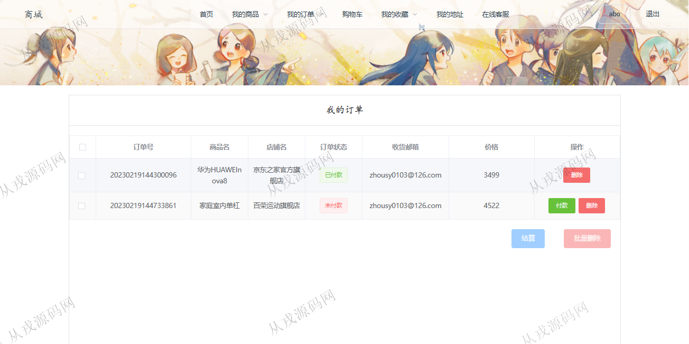
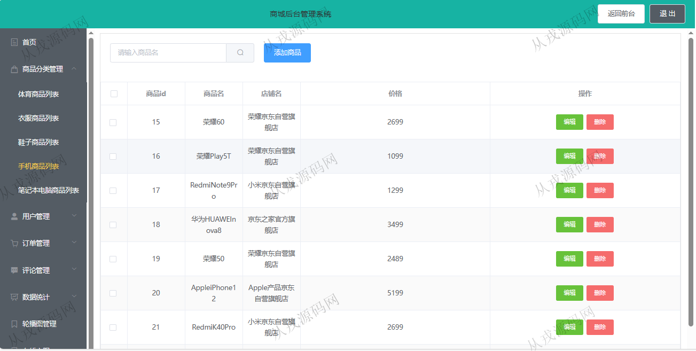
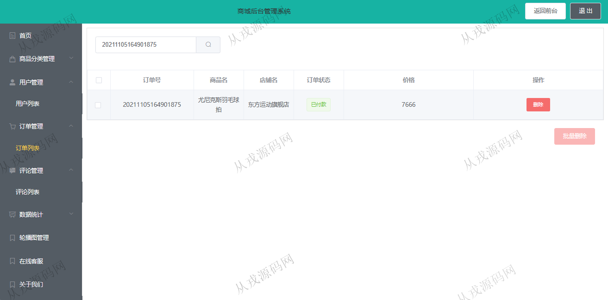
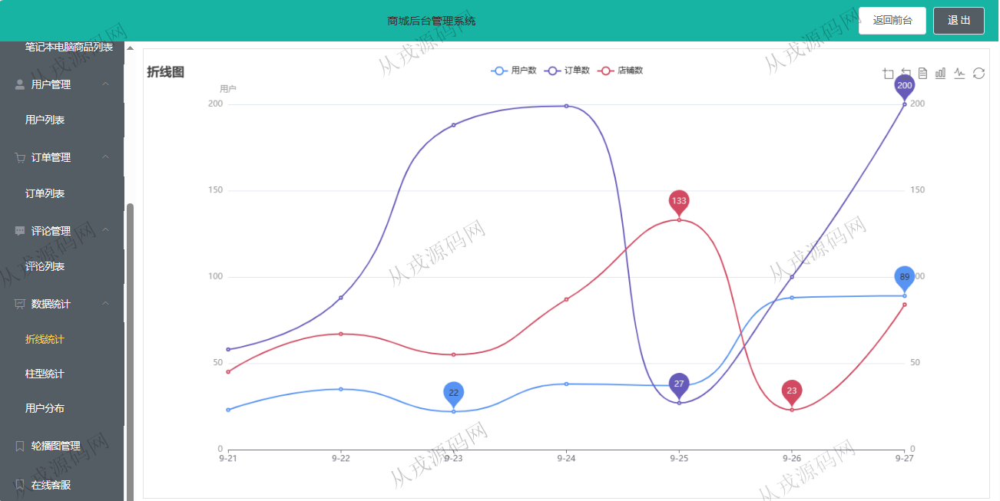

<h1 align="center">220.商城管理系统</h1>

 获取sql文件 QQ: 386869957 QQ群: 377586148 

 [更多源码项目: 从戎源码网](https://armycodes.com/) 

## 简介

> 本代码来源于网络,仅供学习参考使用!
>
> 提供1.远程部署/2.修改代码/3.设计文档指导/4.框架代码讲解等服务
>
> 用户端：http://localhost:8080/login
> 
> 用户：abo abo
> 
> 管理后台：http://localhost:8080/bcakstage
> 
> 管理员：admin admin
>

## 项目介绍
基于springboot+vue的商城管理系统：前端 vue2、elementui，后端 maven、springmvc、spring、mybatis；角色分为管理员、用户；集成商品浏览、购物车、在线下单、订单查询等功能于一体的系统。

## 功能介绍

### 用户

- 基本功能：登录，注册，退出
- 网站首页：主导航栏，轮播图，商品搜索，推荐商品，热门商品
- 商品购买：商品列表浏览，商品详情，立即购买，加入购物车，收藏，在线付款（模拟）
- 我的订单：订单列表查询，订单删除
- 其它功能：我的收藏，我的地址，在线客服

### 管理员

- 商品分类管理：分类信息的增删改查，体育商品分类、衣服商品分类、鞋子商品分类、手机商品分类、电脑商品分类
- 用户管理：用户信息的增删改查，密码修改
- 订单管理：管理员查询用户的下单数据，按订单号查询订单
- 数据统计：折线统计，柱形统计，用户分布图
- 在线客服：查看用户的留言数据，回复操作

## 环境

- <b>IntelliJ IDEA 2021.3</b>

- <b>Mysql 5.7.26</b>

- <b>Node 14.14.0</b>

- <b>JDK 1.8</b>

## 运行截图

